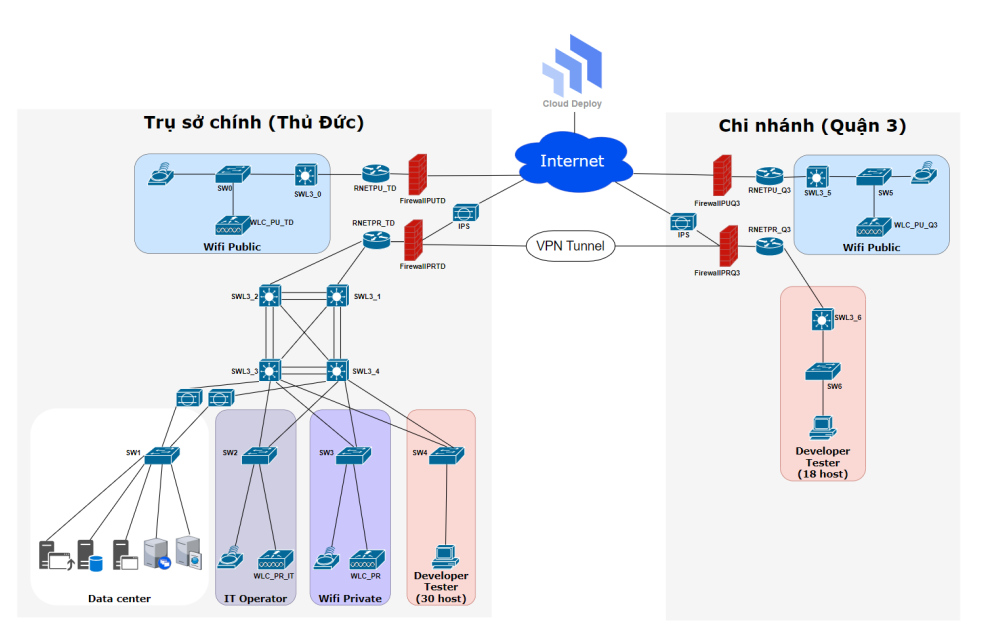
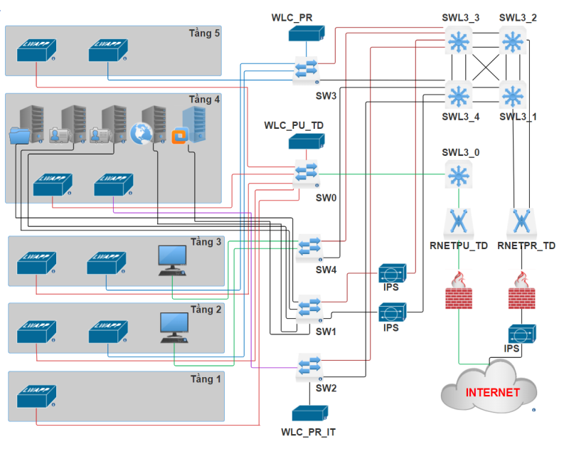

# Network Design

## Overview
Công ty Outsource O-UIT có 1 trụ sở chính tại Thủ Đức và một chi nhánh tại Quận 3. Trụ sở
chính là một tòa nhà 5 tầng gồm Data Center và các văn phòng làm việc dành cho CEO, HR,
Project manager, Technical Manager, Business Analyst, IT manager và các nhóm developer
và tester cho các project thuộc thị trường nước ngoài. Chi nhánh tại Quận 3 là văn phòng
làm việc của các nhóm developer và tester cho các project thuộc thị trường trong nước. 

## Requirements
Công ty muốn thiết lập một hệ thống mạng cho trụ sở chính và chi
nhánh với các yêu cầu sau:
- Tại trụ sở chính
  + Developer và Tester chỉ được sử dụng máy bàn tại công ty, không được sử dụng laptop riêng để truy cập vào mạng của công ty.
  + CEO, HR, Project manager, Technical Manager, Business Analyst, IT operation được sử dụng Laptop, truy cập vào hệ thống wifi nội bộ sử dụng tài khoản xác thực.
  + Một hệ thống wifi public với đường kết nối Internet riêng.
  + Hệ thống phần cứng để triển khai hệ thống server ảo phục vụ cho việc deploy các ứng dụng trong giai đoạn test.
  + Sử dụng các dịch vụ Cloud để deploy các ứng dụng trong giai đoạn staging để khách hàng sử dụng thử trước khi đưa ra thực tế.
- Tại chi nhánh:
  + Developer và Tester chỉ được sử dụng máy bàn tại công ty, không được sử dụng laptop riêng để truy cập vào mạng của công ty.
  + Sử dụng kết nối VPN site-to-site để truy cập server nội bộ và deploy ứng dụng lên hệ thống tại Data Center.
  + Một hệ thống wifi với đường kết nối Internet riêng.

## Logic model

## Physic model

## Report
[Báo cáo đồ án thiết kế mạng](./Bao%20cao%20TKM%20HK1%202023-2024.pdf)

## Content

+ Phân tích yêu cầu của công ty
+ Thiết kế mô hình mạng logic
+ Thiết kế mô hình mạng vật lý
+ Đưa ra giải pháp cho yêu cầu bảo mật của công ty
+ Lựa chọn thiết bị mạng, dịch vụ cloud và thống kê chi phí tham khảo

    ### Requirements
    + [x] Developer và Tester chỉ được sử dụng máy bàn tại công ty, không được sử dụng laptop riêng để truy cập vào mạng của công ty (chi nhánh và trụ sở)
    + [x] CEO, HR, Project manager, Technical Manager, Business Analyst, IT operation được sử dụng Laptop, truy cập vào hệ thống wifi nội bộ sử dụng tài khoản xác thực (trụ sở).
    + [x] Một hệ thống wifi public với đường kết nối Internet riêng (chi nhánh và trụ sở).
    + [x] Hệ thống phần cứng để triển khai hệ thống server ảo phục vụ cho việc deploy các ứng dụng trong giai đoạn test (trụ sở).
    + [x] Sử dụng các dịch vụ Cloud để deploy các ứng dụng trong giai đoạn staging để khách hàng sử dụng thử trước khi đưa ra thực tế (trụ sở).
    + [x] Sử dụng kết nối VPN site-to-site để truy cập server nội bộ và deploy ứng dụng lên hệ thống tại Data Center (chi nhánh).
